The networking services in Azure provide various networking capabilities that can be used together or
separately. Select each of the following networking scenarios to learn more about them:

**Networking foundation**: Azure networking foundation services provide core connectivity
for your resources in Azure - Virtual Network (VNet), Private Link, Azure DNS, Azure
Bastion, Route Server, NAT Gateway, and Traffic Manager.
**Load balancing and content delivery**: Azure load balancing and content delivery
servicesallow for management, distribution, and optimization of your applications and
workloads - Load balancer, Application Gateway, and Azure Front Door.
**Hybrid connectivity**: Azure hybrid connectivity services secure communication to and
from your resources in Azure - VPN Gateway, ExpressRoute, Virtual WAN, and Peering
Service.
**Network security**: Azure network security services protect your web applications and IaaS
services from DDoS attacks and malicious actors - Firewall Manager, Firewall, Web
Application Firewall, and DDoS Protection.
**Network Management and monitoring**: Azure network management and monitoring
services provide tools to manage and monitor your network resources - Network Watcher,
Azure Monitor, and Azure Virtual Network Manager.

# **Networking foundation**

This section describes services that provide the building blocks for designing and architecting a
network environment in Azure - Virtual Network (VNet), Private Link, Azure DNS, Azure Bastion,
Route Server, NAT Gateway, and Traffic Manager.

## **Virtual network**

Azure Virtual Network (VNet) is the fundamental building block for your private network in Azure.
You can use VNets to:

**Communicate between Azure resources**: You can deploy virtual machines, and several
other types of Azure resources to a virtual network, such as Azure App Service
Environments, the Azure Kubernetes Service (AKS), and Azure Virtual Machine Scale Sets.
To view a complete list of Azure resources that you can deploy into a virtual network, see
Virtual network service integration.
**Communicate between each other**: You can connect virtual networks to each other,
enabling resources in either virtual network to communicate with each other, using virtual
network peering or Azure Virtual Network Manager. The virtual networks you connect can
be in the same, or different, Azure regions. For more information, see Virtual network
peering and Azure Virtual Network Manager.
**Communicate to the internet**: All resources in a virtual network can communicate
outbound to the internet, by default. You can communicate inbound to a resource by
assigning a public IP address or a public Load Balancer. You can also use Public IP
addresses or public Load Balancer to manage your outbound connections.
**Communicate with on-premises networks**: You can connect your on-premises computers
and networks to a virtual network using VPN Gateway or ExpressRoute.

# **Azure networking services overview**

7/7/25, 8:17 AM
Azure networking services overview

read://https_learn.microsoft.com/?url=https%3A%2F%2Flearn.microsoft.com%2Fen-us%2Fazure%2Fnetworking%2Ffundamentals%2Fnetworking-overview
1/16

---
*Page 2*

**Encrypt traffic between resources**: You can use Virtual network encryption to encrypt
traffic between resources in a virtual network.

**Network security groups**

You can filter network traffic to and from Azure resources in an Azure virtual network with a network
security group. For more information, see Network security groups.

**Service endpoints**

Virtual Network (VNet) service endpoints extend your virtual network private address space and the
identity of your virtual network to the Azure services, over a direct connection. Endpoints allow you to
secure your critical Azure service resources to only your virtual networks. Traffic from your virtual
network to the Azure service always remains on the Microsoft Azure backbone network.

## **Azure Private Link**

Azure Private Link enables you to access Azure PaaS Services (for example, Azure Storage and SQL
Database) and Azure hosted customer-owned/partner services over a private endpoint in your virtual
network. Traffic between your virtual network and the service travels through the Microsoft backbone
network. Exposing your service to the public internet is no longer necessary. You can create your own
private link service in your virtual network and deliver it to your customers.

7/7/25, 8:17 AM
Azure networking services overview

read://https_learn.microsoft.com/?url=https%3A%2F%2Flearn.microsoft.com%2Fen-us%2Fazure%2Fnetworking%2Ffundamentals%2Fnetworking-overview
2/16

---
*Page 3*

## **Azure DNS**

Azure DNS provides DNS hosting and resolution using the Microsoft Azure infrastructure. Azure DNS
consists of three services:

Azure Public DNS is a hosting service for DNS domains. By hosting your domains in
Azure, you can manage your DNS records by using the same credentials, APIs, tools, and
billing as your other Azure services.
Azure Private DNS is a DNS service for your virtual networks. Azure Private DNS manages
and resolves domain names in the virtual network without the need to configure a custom
DNS solution.
Azure DNS Private Resolver is a service that enables you to query Azure DNS private
zones from an on-premises environment and vice versa without deploying VM based DNS
servers.

Using Azure DNS, you can host and resolve public domains, manage DNS resolution in your virtual
networks, and enable name resolution between Azure and your on-premises resources.

## **Azure Bastion**

Azure Bastion is a service that you can deploy in a virtual network to allow you to connect to a virtual
machine using your browser and the Azure portal. You can also connect using the native SSH or RDP
client already installed on your local computer. The Azure Bastion service is a fully platform-managed
PaaS service that you deploy inside your virtual network. It provides secure and seamless RDP/SSH
connectivity to your virtual machines directly from the Azure portal over TLS. When you connect via
Azure Bastion, your virtual machines don't need a public IP address, agent, or special client software.
There are various different SKU/tiers available for Azure Bastion. The tier you select affects the
features that are available. For more information, see About Bastion configuration settings.

7/7/25, 8:17 AM
Azure networking services overview

read://https_learn.microsoft.com/?url=https%3A%2F%2Flearn.microsoft.com%2Fen-us%2Fazure%2Fnetworking%2Ffundamentals%2Fnetworking-overview
3/16

---
*Page 4*

## **Azure Route Server**

Azure Route Server simplifies dynamic routing between your network virtual appliance (NVA) and
your virtual network. It allows you to exchange routing information directly through Border Gateway
Protocol (BGP) routing protocol between any NVA that supports the BGP routing protocol and the
Azure Software Defined Network (SDN) in the Azure Virtual Network (VNet) without the need to
manually configure or maintain route tables.

## **NAT Gateway**

NAT Gateway simplifies outbound-only Internet connectivity for virtual networks. When configured on
a subnet, all outbound connectivity uses your specified static public IP addresses. Outbound

7/7/25, 8:17 AM
Azure networking services overview

read://https_learn.microsoft.com/?url=https%3A%2F%2Flearn.microsoft.com%2Fen-us%2Fazure%2Fnetworking%2Ffundamentals%2Fnetworking-overview
4/16

---
*Page 5*

connectivity is possible without load balancer or public IP addresses directly attached to virtual
machines. For more information, see What is Azure NAT gateway?

## **Traffic Manager**

Azure Traffic Manager is a DNS-based traffic load balancer that enables you to distribute traffic
optimally to services across global Azure regions, while providing high availability and
responsiveness. Traffic Manager provides a range of traffic-routing methods to distribute traffic such as
priority, weighted, performance, geographic, multi-value, or subnet.

The following diagram shows endpoint priority-based routing with Traffic Manager:

7/7/25, 8:17 AM
Azure networking services overview

read://https_learn.microsoft.com/?url=https%3A%2F%2Flearn.microsoft.com%2Fen-us%2Fazure%2Fnetworking%2Ffundamentals%2Fnetworking-overview
5/16

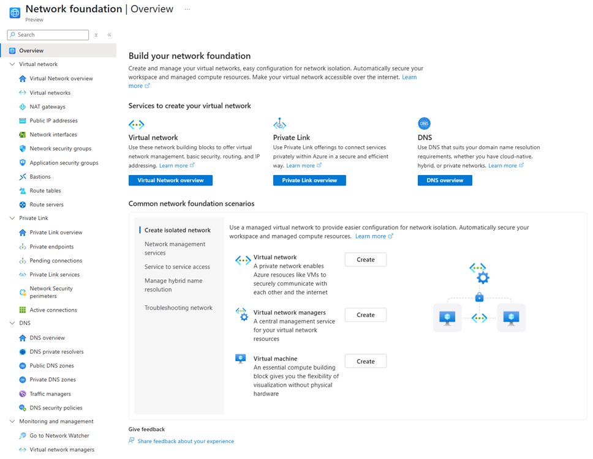

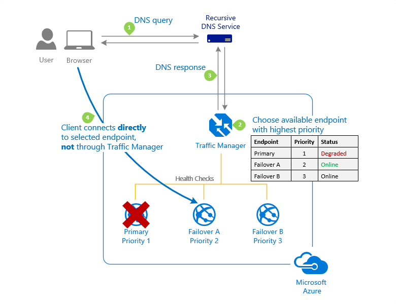

---
*Page 6*

For more information about Traffic Manager, see What is Azure Traffic Manager?.

# **Load balancing and content delivery**

This section describes networking services in Azure that help deliver applications and workloads -
Load Balancer, Application Gateway, and Azure Front Door Service.

## **Load Balancer**

Azure Load Balancer provides high-performance, low-latency Layer 4 load-balancing for all UDP and
TCP protocols. It manages inbound and outbound connections. You can configure public and internal
load-balanced endpoints. You can define rules to map inbound connections to back-end pool
destinations by using TCP and HTTP health-probing options to manage service availability.

Azure Load Balancer is available in Standard, Regional, and Gateway SKUs.

The following picture shows an Internet-facing multi-tier application that utilizes both external and
internal load balancers:

## **Application Gateway**

Azure Application Gateway is a web traffic load balancer that enables you to manage traffic to your
web applications. It's an Application Delivery Controller (ADC) as a service, offering various layer 7
load-balancing capabilities for your applications.

The following diagram shows url path-based routing with Application Gateway.

7/7/25, 8:17 AM
Azure networking services overview

read://https_learn.microsoft.com/?url=https%3A%2F%2Flearn.microsoft.com%2Fen-us%2Fazure%2Fnetworking%2Ffundamentals%2Fnetworking-overview
6/16

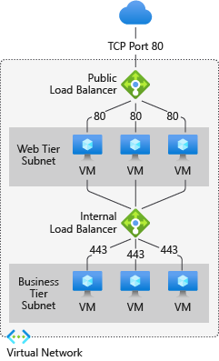

---
*Page 7*

## **Azure Front Door**

Azure Front Door enables you to define, manage, and monitor the global routing for your web traffic
by optimizing for best performance and instant global failover for high availability. With Front Door,
you can transform your global (multi-region) consumer and enterprise applications into robust, high-
performance personalized modern applications, APIs, and content that reach a global audience with
Azure.

7/7/25, 8:17 AM
Azure networking services overview

read://https_learn.microsoft.com/?url=https%3A%2F%2Flearn.microsoft.com%2Fen-us%2Fazure%2Fnetworking%2Ffundamentals%2Fnetworking-overview
7/16

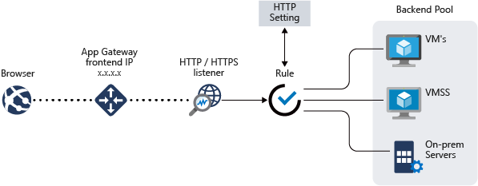

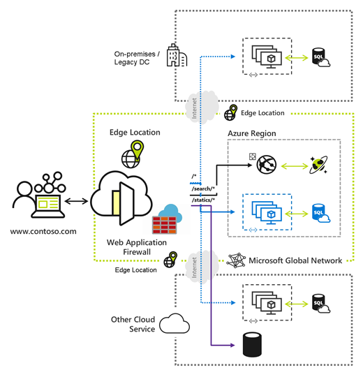

---
*Page 8*

# **Hybrid connectivity**

This section describes network connectivity services that provide a secure communication between
your on-premises network and Azure - VPN Gateway, ExpressRoute, Virtual WAN, and Peering
Service.

## **VPN Gateway**

VPN Gateway helps you create encrypted cross-premises connections to your virtual network from on-
premises locations, or create encrypted connections between VNets. There are different configurations
available for VPN Gateway connections. Some of the main features include:

Site-to-site VPN connectivity
Point-to-site VPN connectivity
VNet-to-VNet VPN connectivity

The following diagram illustrates multiple site-to-site VPN connections to the same virtual network. To
view more connection diagrams, see VPN Gateway - design.

## **ExpressRoute**

ExpressRoute enables you to extend your on-premises networks into the Microsoft cloud over a private
connection facilitated by a connectivity provider. This connection is private. Traffic doesn't go over the
internet. With ExpressRoute, you can establish connections to Microsoft cloud services, such as
Microsoft Azure, Microsoft 365, and Dynamics 365.

7/7/25, 8:17 AM
Azure networking services overview

read://https_learn.microsoft.com/?url=https%3A%2F%2Flearn.microsoft.com%2Fen-us%2Fazure%2Fnetworking%2Ffundamentals%2Fnetworking-overview
8/16

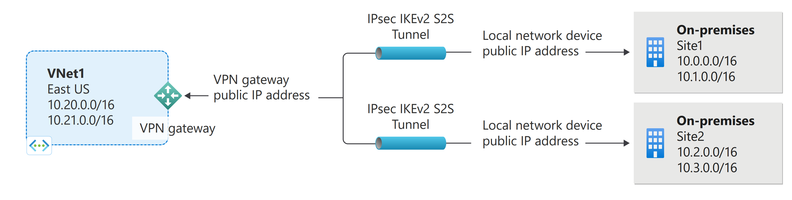

---
*Page 9*

## **Virtual WAN**

Azure Virtual WAN is a networking service that brings many networking, security, and routing
functionalities together to provide a single operational interface. Connectivity to Azure VNets is
established by using virtual network connections. Some of the main features include:

Branch connectivity (via connectivity automation from Virtual WAN Partner devices such
as SD-WAN or VPN CPE)
Site-to-site VPN connectivity
Remote user VPN connectivity (point-to-site)
Private connectivity (ExpressRoute)
Intra-cloud connectivity (transitive connectivity for virtual networks)
VPN ExpressRoute inter-connectivity
Routing, Azure Firewall, and encryption for private connectivity

7/7/25, 8:17 AM
Azure networking services overview

read://https_learn.microsoft.com/?url=https%3A%2F%2Flearn.microsoft.com%2Fen-us%2Fazure%2Fnetworking%2Ffundamentals%2Fnetworking-overview
9/16

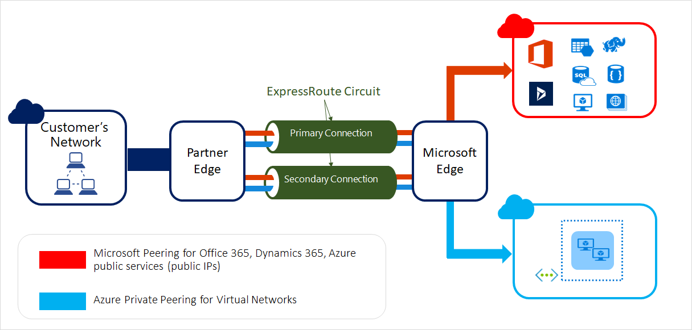

---
*Page 10*

## **Peering Service**

Azure Peering Service enhances customer connectivity to Microsoft cloud services such as Microsoft
365, Dynamics 365, software as a service (SaaS) services, Azure, or any Microsoft services accessible
via the public internet.

# **Network security**

This section describes networking services in Azure that protects and monitor your network resources -
Firewall Manager, Firewall, Web Application Firewall, and DDoS Protection.

## **Firewall Manager**

Azure Firewall Manager is a security management service that provides central security policy and
routing management for cloud based security perimeters. Firewall manager can provide security
management for two different types of network architecture: secure virtual hub and hub virtual
network. With Azure Firewall Manager, you can deploy multiple Azure Firewall instances across Azure
regions and subscriptions, implement DDoS protection plans, manage web application firewall
policies, and integrate with partner security-as-a-service for enhanced security.

7/7/25, 8:17 AM
Azure networking services overview

read://https_learn.microsoft.com/?url=https%3A%2F%2Flearn.microsoft.com%2Fen-us%2Fazure%2Fnetworking%2Ffundamentals%2Fnetworking-overview
10/16

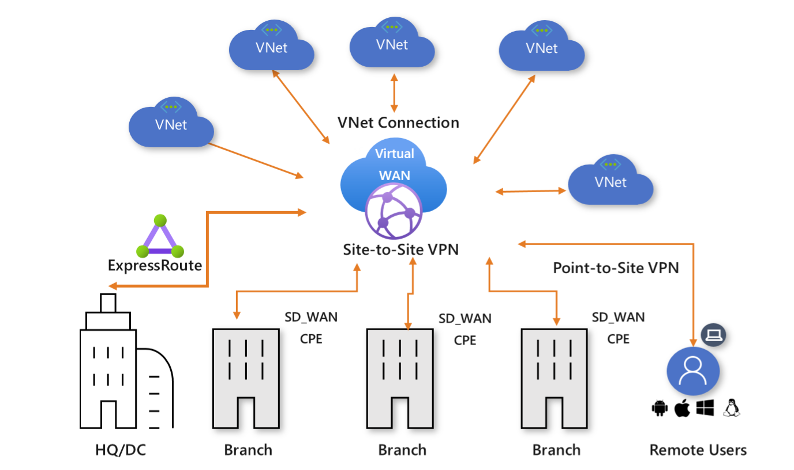

---
*Page 11*

## **Azure Firewall**

Azure Firewall is a managed, cloud-based network security service that protects your Azure Virtual
Network resources. Using Azure Firewall, you can centrally create, enforce, and log application and
network connectivity policies across subscriptions and virtual networks. Azure Firewall uses a static
public IP address for your virtual network resources allowing outside firewalls to identify traffic
originating from your virtual network.

7/7/25, 8:17 AM
Azure networking services overview

read://https_learn.microsoft.com/?url=https%3A%2F%2Flearn.microsoft.com%2Fen-us%2Fazure%2Fnetworking%2Ffundamentals%2Fnetworking-overview
11/16

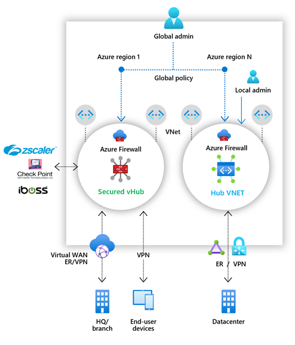

---
*Page 12*

## **Web Application Firewall**

Azure Web Application Firewall (WAF) provides protection to your web applications from common
web exploits and vulnerabilities such as SQL injection, and cross site scripting. Azure WAF provides
out of box protection from OWASP top 10 vulnerabilities via managed rules. Additionally customers
can also configure custom rules, which are customer managed rules to provide extra protection based
on source IP range, and request attributes such as headers, cookies, form data fields, or query string
parameters.

Customers can choose to deploy Azure WAF with Application Gateway, which provides regional
protection to entities in public and private address space. Customers can also choose to deploy Azure
WAF with Front Door which provides protection at the network edge to public endpoints.

7/7/25, 8:17 AM
Azure networking services overview

read://https_learn.microsoft.com/?url=https%3A%2F%2Flearn.microsoft.com%2Fen-us%2Fazure%2Fnetworking%2Ffundamentals%2Fnetworking-overview
12/16

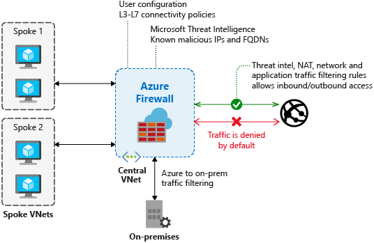

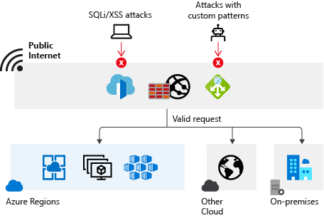

---
*Page 13*

## **DDoS Protection**

Azure DDoS Protection provides countermeasures against the most sophisticated DDoS threats. The
service provides enhanced DDoS mitigation capabilities for your application and resources deployed in
your virtual networks. Additionally, customers using Azure DDoS Protection have access to DDoS
Rapid Response support to engage DDoS experts during an active attack.

Azure DDoS Protection consists of two tiers:

DDoS Network Protection, combined with application design best practices, provides
enhanced DDoS mitigation features to defend against DDoS attacks. It's automatically
tuned to help protect your specific Azure resources in a virtual network.
DDoS IP Protection is a pay-per-protected IP model. DDoS IP Protection contains the same
core engineering features as DDoS Network Protection, but differs in the following value-
added services: DDoS rapid response support, cost protection, and discounts on WAF.

## **Container network security**

Container network security is part of Advanced Container Networking Services. Advanced Container
Networking Services provides enhanced control over AKS network security. With features like fully
qualified domain name (FQDN) filtering, clusters using Azure CNI Powered by Cilium can implement
FQDN-based network policies to achieve a Zero Trust security architecture in AKS.

# **Network Management and monitoring**

This section describes network management and monitoring services in Azure - Network Watcher,
Azure Monitor, and Azure Virtual Network Manager.

## **Azure Network Watcher**

Azure Network Watcher provides tools to monitor, diagnose, view metrics, and enable or disable logs
for resources in an Azure virtual network.

7/7/25, 8:17 AM
Azure networking services overview

read://https_learn.microsoft.com/?url=https%3A%2F%2Flearn.microsoft.com%2Fen-us%2Fazure%2Fnetworking%2Ffundamentals%2Fnetworking-overview
13/16

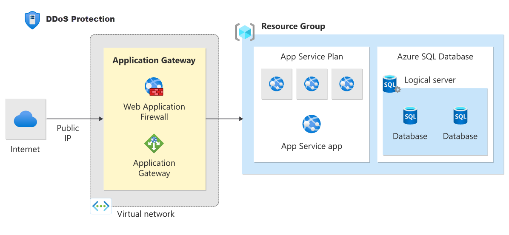

---
*Page 14*

## **Azure Monitor**

Azure Monitor maximizes the availability and performance of your applications by delivering a
comprehensive solution for collecting, analyzing, and acting on telemetry from your cloud and on-
premises environments. It helps you understand how your applications are performing and proactively
identifies issues affecting them and the resources they depend on.

## **Azure Virtual Network Manager**

Azure Virtual Network Manager is a management service that enables you to group, configure, deploy,
and manage virtual networks globally across subscriptions. With Virtual Network Manager, you can
define network groups to identify and logically segment your virtual networks. Then you can determine
the connectivity and security configurations you want and apply them across all the selected virtual
networks in network groups at once.

7/7/25, 8:17 AM
Azure networking services overview

read://https_learn.microsoft.com/?url=https%3A%2F%2Flearn.microsoft.com%2Fen-us%2Fazure%2Fnetworking%2Ffundamentals%2Fnetworking-overview
14/16

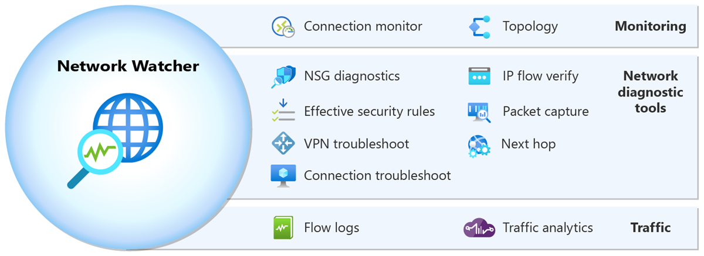

---
*Page 15*

7/7/25, 8:17 AM
Azure networking services overview

read://https_learn.microsoft.com/?url=https%3A%2F%2Flearn.microsoft.com%2Fen-us%2Fazure%2Fnetworking%2Ffundamentals%2Fnetworking-overview
15/16

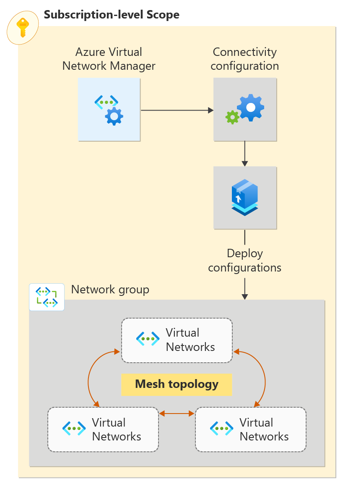

---
*Page 16*

## **Container network observability**

Container network observability is part of Advanced Container Networking Services. Advanced
Container Networking Services uses Hubble’s control plane to provide comprehensive visibility into
AKS networking and performance. It offers real-time, detailed insights across node-level, pod-level,
TCP, and DNS metrics, ensuring thorough monitoring of your network infrastructure.

# **Next steps**

Create your first virtual network, and connect a few virtual machines to it, by completing
the steps in the Create your first virtual network article.
Connect your computer to a virtual network by completing the steps in the Configure a
point-to-site connection article.
Load balance Internet traffic to public servers by completing the steps in the Create an
Internet-facing load balancer article.

7/7/25, 8:17 AM
Azure networking services overview

read://https_learn.microsoft.com/?url=https%3A%2F%2Flearn.microsoft.com%2Fen-us%2Fazure%2Fnetworking%2Ffundamentals%2Fnetworking-overview
16/16

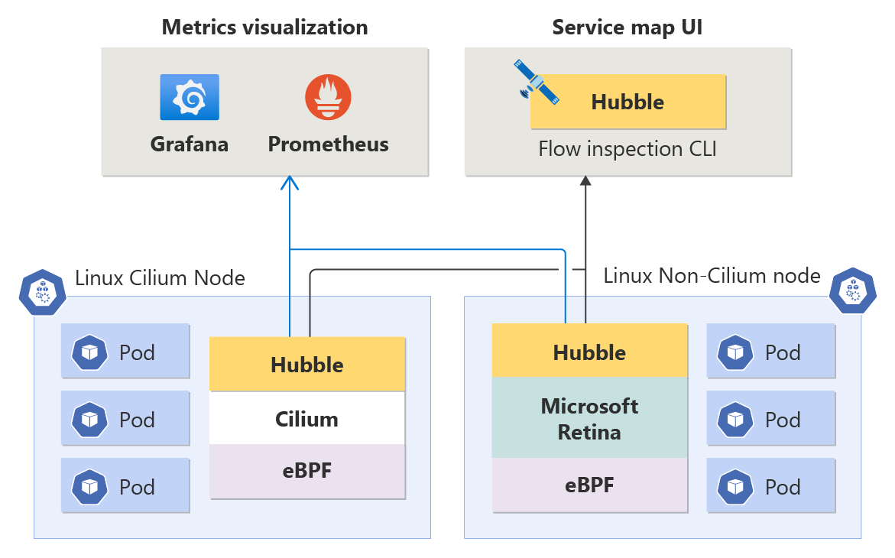