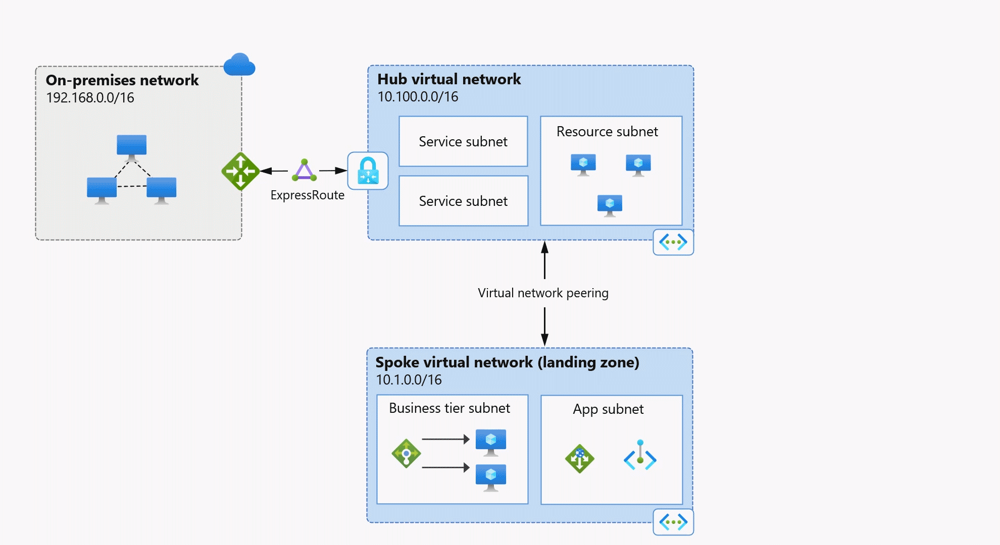
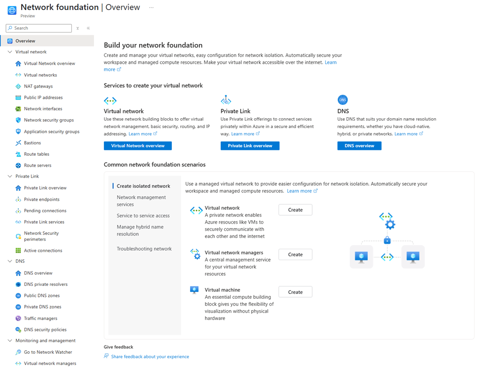

Azure network foundation services provide core connectivity for your resources in Azure. Network
foundation services include **Azure Virtual Network**, **Azure Private Link**, and **Azure DNS**. Together,
these core services build upon each other to provide the foundation for your Azure network.

The following diagram is an example of how these services can be used together in a basic Azure
network.

This article provides a summary of each of these Azure foundational services, and illustrates how they
work together. Links are also provided to more detailed guidance for each foundational service.

# **Azure Virtual Network**

Azure Virtual Network enables you to create private networks in the cloud, securely connecting Azure
resources, the Internet, and on-premises networks.

Two virtual networks are provisioned in the following example:

The hub virtual network is used to deploy Azure services and provide access to data
resources. The hub is optionally connected to an on-premises network.
The hub peers with a spoke network containing a business tier subnet with virtual machines
to process user interactions, and an application subnet to handle data storage and
transactions.

# **Azure network foundation services overview**

7/7/25, 8:20 AM
Azure network foundation services overview

read://https_learn.microsoft.com/?url=https%3A%2F%2Flearn.microsoft.com%2Fen-us%2Fazure%2Fnetworking%2Ffoundations%2Fnetwork-foundations-overview…
1/5

---
*Page 2*

Service subnet

**Hub virtual network**
10.100.0.0/16
**On-premises network**
192.168.0.0/16

**Spoke virtual network (landing zone)**
10.1.0.0/16

Virtual network peering

ExpressRoute

Business tier subnet

App subnet

Resource subnet

Service subnet

For more information about designing virtual networks, see Plan virtual networks. To create a virtual
network, see Use the Azure portal to create a virtual network.

# **Azure Private Link**

Azure Private Link enables secure, private connectivity from your virtual network to services that don't
traverse the public Internet.

In the following figure, a **private endpoint** is provisioned in the app subnet of the spoke virtual
network described previously. A private endpoint is a private IP address (10.1.1.135 in this example)
associated with a service powered by Azure Private Link.

Private endpoints securely connect services within virtual networks.

7/7/25, 8:20 AM
Azure network foundation services overview

read://https_learn.microsoft.com/?url=https%3A%2F%2Flearn.microsoft.com%2Fen-us%2Fazure%2Fnetworking%2Ffoundations%2Fnetwork-foundations-overview…
2/5

| Virtual netw | ork peering |
| --- | --- |

---
*Page 3*

Service subnet

**Hub virtual network**
10.100.0.0/16
**On-premises network**
192.168.0.0/16

**Spoke virtual network (landing zone)**
10.1.0.0/16

Virtual network peering

ExpressRoute

Business tier subnet

App subnet

Resource subnet

**Azure storage**

**Private**
**endpoint**
10.1.1.135

Service subnet

**Azure**
**Private Link**

Note

When you create a private endpoint, you're given the choice of integrating with a private DNS zone.
This configuration can be added, deleted, or modified later. In the example shown here, the option to
integrate with a private DNS zone is selected. This basic DNS configuration is suitable for virtual
network workloads that don't use an Azure DNS Private Resolver. For more information, see Azure
Private Endpoint DNS integration.

For an overview of private link and private endpoint, see What is Azure Private Link service and What
is a private endpoint. To create a private endpoint, see Create a private endpoint.

# **Azure DNS**

Azure DNS provides cloud-based public and private domain name hosting and resolution. It includes
three services that provide public or private DNS resolution and hosting, and one load balancing
service:

Azure Public DNS provides high-availability hosting for public DNS domains.
Azure Private DNS is a DNS naming and resolution service for virtual networks and the
private services hosted inside those networks.
Azure DNS Private Resolver is a fully managed high availability DNS service that enables
you to query private DNS zones from an on-premises environment and vice versa without
deploying VM based DNS servers.
Azure Traffic Manager: A DNS-based traffic load balancer that can distribute traffic to
public facing applications across Azure regions.

Azure DNS also provides internal DNS resolution for both private and public (internet) resources from
within virtual networks. By default, virtual networks are configured to resolve DNS records using
Azure-provided DNS at 168.63.129.16.

In the following example, the private endpoint shown in the previous figure is associated with the
private DNS zone **privatelink.blob.core.windows.net**. The private DNS zone name is dependent on

7/7/25, 8:20 AM
Azure network foundation services overview

read://https_learn.microsoft.com/?url=https%3A%2F%2Flearn.microsoft.com%2Fen-us%2Fazure%2Fnetworking%2Ffoundations%2Fnetwork-foundations-overview…
3/5

| Virtual netw | ork peering |
| --- | --- |

---
*Page 4*

the type of private endpoint resource. In this example, the resource is blob storage. For more
information about private DNS zones and private endpoints, see Azure Private Endpoint private DNS
zone values.

This zone is also configured with a virtual network link to the hub virtual network, enabling all
resources in the hub network to resolve the zone using Azure-provided DNS (168.63.129.16) and
providing access to the private endpoint using its fully qualified DNS name (FQDN).

Service subnet

**Hub virtual network**
10.100.0.0/16
**On-premises network**
192.168.0.0/16

**Spoke virtual network (landing zone)**
10.1.0.0/16

Virtual network peering

ExpressRoute

Business tier subnet

App subnet

Resource subnet

**Azure storage**

**Private**
**endpoint**
10.1.1.135

Azure provided DNS
168.63.129.16

**Private DNS zone**
privatelink.blob.core.
windows.net

Azure provided DNS
168.63.129.16

Virtual Network Link

Service subnet

**Azure**
**Private Link**

By default, private endpoints can only be resolved from within Azure. To resolve the private-linked
storage account from on-premises, or to resolve on-premises resources from within Azure, you can
configure a **DNS private resolver** in the hub virtual network (not shown).

For information about private endpoint scenarios with an Azure DNS Private Resolver, see private
endpoint DNS configuration scenarios.

For more information about configuring a DNS private resolver, see Resolve Azure and on-premises
domains.

# **Azure portal experience**

The Azure portal provides a centralized experience for getting started with network foundation
services. Information and links are provided to help you create an isolated network, manage network
services, secure access to resources, manage hybrid name resolution, and troubleshoot network issues.

7/7/25, 8:20 AM
Azure network foundation services overview

read://https_learn.microsoft.com/?url=https%3A%2F%2Flearn.microsoft.com%2Fen-us%2Fazure%2Fnetworking%2Ffoundations%2Fnetwork-foundations-overview…
4/5

| Virtual netw | ork peering |
| --- | --- |

---
*Page 5*

Resource links are also provided in the left-hand service tree to help you understand, create, and view
supporting components of the network foundation services.

# **Learn more**

7/7/25, 8:20 AM
Azure network foundation services overview

read://https_learn.microsoft.com/?url=https%3A%2F%2Flearn.microsoft.com%2Fen-us%2Fazure%2Fnetworking%2Ffoundations%2Fnetwork-foundations-overview…
5/5

