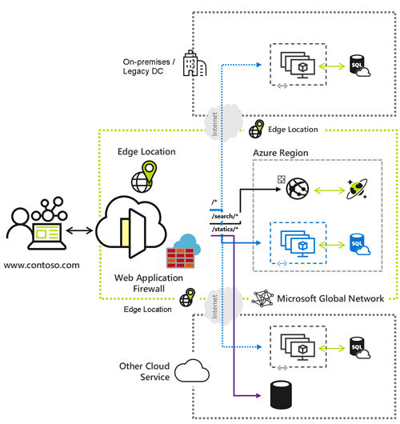

Azure Front Door Standard/Premium in Microsoft Azure combines the features available in Azure
Front Door, Microsoft Azure Content Delivery Network, and Azure Web Application Firewall. It helps
provide a fast, reliable, and more secure modern cloud content delivery network (CDN). This CDN
integrates with intelligent threat protection.

# **Example scenario**

Suppose you work for an organization that hosts several critical public-facing consumer applications in
Azure. You want to ensure your applications are highly available and perform well. In addition, you
want to ensure they're protected by appropriate security measures.

In the past, you might have used a CDN to help ensure your application's availability and performance.
You also might have implemented features to help manage security, such as a web application firewall.
However, with Azure Front Door, you can combine these components into a single entity with simple
pricing.

# **What will we be doing?**

In this module, you identify the Azure Front Door Standard/Premium features. You then compare them
with the Azure Front Door, Azure Content Delivery Network, and Azure Web Application Firewall
features. You also assess whether Azure Front Door can help you transform your global consumer and
enterprise application into a more secure, high-performing, and personalized modern application.
Finally, you determine when to use Azure Front Door Standard/Premium.

# **Introduction to Azure Front Door**

7/7/25, 8:27 AM
Introduction to Azure Front Door

read://https_learn.microsoft.com/?url=https%3A%2F%2Flearn.microsoft.com%2Fen-us%2Ftraining%2Fmodules%2Fintro-to-azure-front-door%2F1-introduction
1/2

---
*Page 2*

# **What's the main goal?**

By the end of this module, you're able to evaluate whether Azure Front Door Standard/Premium can
improve delivery of your organization's application infrastructure. You're also able to describe how
Azure Front Door Standard/Premium features can help protect your applications.

7/7/25, 8:27 AM
Introduction to Azure Front Door

read://https_learn.microsoft.com/?url=https%3A%2F%2Flearn.microsoft.com%2Fen-us%2Ftraining%2Fmodules%2Fintro-to-azure-front-door%2F1-introduction
2/2