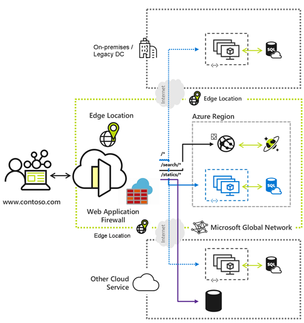

Whether you're delivering content and files or developing global applications and APIs, Azure Front
Door enhances your user experience by providing higher availability, reduced latency, increased
scalability, and improved security, no matter where your users are located.

Azure Front Door is Microsoft's advanced cloud Content Delivery Network (CDN) designed to provide
fast, reliable, and secure access to your applications' static and dynamic web content globally. By using
Microsoft's extensive global edge network, Azure Front Door ensures efficient content delivery through
numerous global and local points of presence (PoPs) strategically positioned close to both enterprise
and consumer end users.

Note

For web workloads, we highly recommend utilizing **Azure DDoS protection** and a **web application**
**firewall** to safeguard against emerging DDoS attacks. Another option is to employ along with a web
application firewall. Azure Front Door offers **platform-level protection** against network-level DDoS
attacks. For more information, see **security baseline for Azure services**.

Note

# **Azure Front Door**

7/7/25, 8:29 AM
Azure Front Door

read://https_learn.microsoft.com/?url=https%3A%2F%2Flearn.microsoft.com%2Fen-us%2Fazure%2Ffrontdoor%2Ffront-door-overview
1/4

---
*Page 2*

Azure Front Door is one of the services that make up the Load Balancing and Content Delivery
category in Azure. Other services in this category include Azure Load Balancer and Azure Application
Gateway. Each service has its own unique features and use cases. For more information on this service
category, see Load Balancing and Content Delivery.

# **Why use Azure Front Door?**

Azure Front Door enables internet-facing application to:

**Build and operate modern internet-first architectures** that have dynamic, high-quality
digital experiences with highly automated, secure, and reliable platforms.

**Accelerate and deliver your app and content globally** at scale to your users wherever
they're creating opportunities for you to compete, weather change, and quickly adapt to new
demand and markets.

**Intelligently secure your digital estate** against known and new threats with intelligent
security that embrace a ***Zero Trust*** framework.

# **Key Benefits**

## **Global delivery scale using Microsoft’s network**

Scale out and improve performance of your applications and content using Microsoft’s global Cloud
CDN and WAN.

Uses over 118 edge locations across 100 metro cities connected to Azure using a private
enterprise-grade WAN and improve latency for apps by up to three times.

Accelerate application performance by using Front Door’s anycast network and split TCP
connections.

Terminate SSL offload at the edge and use integrated certificate management.

Natively support end-to-end IPv6 connectivity and the HTTP/2 protocol.

## **Deliver modern apps and architectures**

Modernize your internet first applications on Azure with Cloud Native experiences

Integrate with DevOps friendly command line tools across SDKs of different languages,
Bicep, ARM templates, CLI, and PowerShell.

Define your own custom domain with flexible domain validation.

Load balance and route traffic across origins and use intelligent health probe monitoring
across apps or content hosted in Azure or anywhere.

7/7/25, 8:29 AM
Azure Front Door

read://https_learn.microsoft.com/?url=https%3A%2F%2Flearn.microsoft.com%2Fen-us%2Fazure%2Ffrontdoor%2Ffront-door-overview
2/4

---
*Page 3*

Integrate with other Azure services such as DNS, Web Apps, Storage, and many more for
domain and origin management.

Move your routing business logic to the edge with enhanced rules engine capabilities
including regular expressions and server variables.

Analyze built-in reports with an all-in-one dashboard for both Front Door and security
patterns.

Monitor your Front Door traffic in real time, and configure alerts that integrate with Azure
Monitor.

Log each Front Door request and failed health probes.

## **Simple and cost-effective**

Unified static and dynamic delivery offered in a single tier to accelerate and scale your
application through caching, SSL offload, and layer 3-4 DDoS protection.

Free, autorotation managed SSL certificates that save time and quickly secure apps and
content.

Low entry fee and a simplified cost model that reduces billing complexity by having fewer
meters needed to plan for.

Azure to Front Door integrated egress pricing that removes the separate egress charge from
Azure regions to Azure Front Door. For more information, see Azure Front Door pricing.

## **Intelligent secure internet perimeter**

Secure applications with built-in layer 3-4 DDoS protection, seamlessly attached Web
Application Firewall (WAF), and Azure DNS to protect your domains.

Protect your applications against layer 7 DDoS attacks using WAF. For more information,
see Application DDoS protection.

Protect your applications from malicious actors with Bot manager rules based on
Microsoft’s own Threat Intelligence.

Privately connect to your backend behind Azure Front Door with Private Link and embrace
a zero-trust access model.

Provide a centralized security experience for your application via Azure Policy and Azure
Advisor that ensures consistent security features across apps.

# **How to choose between Azure Front Door tiers?**

For a comparison of supported features in Azure Front Door, see Tier comparison.

7/7/25, 8:29 AM
Azure Front Door

read://https_learn.microsoft.com/?url=https%3A%2F%2Flearn.microsoft.com%2Fen-us%2Fazure%2Ffrontdoor%2Ffront-door-overview
3/4

---
*Page 4*

# **Where is the service available?**

Azure Front Door Standard, Premium, and Classic tiers are available in Microsoft Azure (Commercial)
and Microsoft Azure Government (US).

# **Pricing**

For pricing information, see Front Door Pricing. For information about service-level agreements, See
SLA for Azure Front Door.

# **What's new?**

Subscribe to the RSS feed and view the latest Azure Front Door feature updates on the Azure Updates
page.

# **Next steps**

7/7/25, 8:29 AM
Azure Front Door

read://https_learn.microsoft.com/?url=https%3A%2F%2Flearn.microsoft.com%2Fen-us%2Fazure%2Ffrontdoor%2Ffront-door-overview
4/4