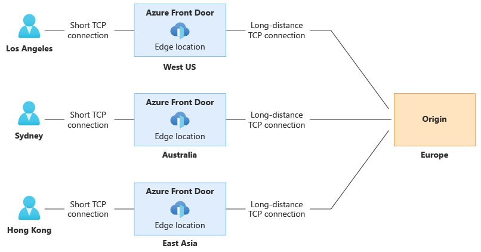

Azure Front Door traffic routing takes place over multiple stages. First, traffic is routed from the client
to the Front Door. Then, Front Door uses your configuration to determine the origin to send the traffic
to. The Front Door web application firewall, routing rules, rules engine, and caching configuration can
all affect the routing process.

The following diagram illustrates the routing architecture:

Important

Azure Front Door (classic) will be retired on **March 31, 2027**. To avoid any service disruption, it's
important that you **migrate your Azure Front Door (classic) profiles** to Azure Front Door Standard or
Premium tier by March 2027. For more information, see **Azure Front Door (classic) retirement**.

# **Routing architecture overview**

7/7/25, 8:30 AM
Routing architecture overview

read://https_learn.microsoft.com/?url=https%3A%2F%2Flearn.microsoft.com%2Fen-us%2Fazure%2Ffrontdoor%2Ffront-door-routing-architecture%3Fpivots%3Dfr…
1/4

---
*Page 2*

The rest of this article describes these steps in detail.

# **Select and connect to the Front Door edge location**

The user or client application initiates a connection to the Front Door. The connection terminates at an
edge location closest to the end user. Front Door's edge location processes the request.

For more information about how requests are made to Front Door, see Front Door traffic acceleration.

# **Match request to a Front Door profile**

When Front Door receives an HTTP request, it uses the request's Host header to match the request to
the correct customer's Front Door profile. If the request is using a custom domain name, the domain
name must be registered with Front Door to enable requests to get matched to your profile.

# **Match request to a front door**

When Front Door receives an HTTP request, it uses the request's Host header to match the request to
the correct customer's Front Door instance. If the request is using a custom domain name, the domain
name must be registered with Front Door to enable requests to get matched to your Front door.

The client and server perform a TLS handshake using the TLS certificate you configured for your
custom domain name, or by using the Front Door certificate when the Host header ends with

7/7/25, 8:30 AM
Routing architecture overview

read://https_learn.microsoft.com/?url=https%3A%2F%2Flearn.microsoft.com%2Fen-us%2Fazure%2Ffrontdoor%2Ffront-door-routing-architecture%3Fpivots%3Dfr…
2/4

---
*Page 3*

*.azurefd.net.

# **Evaluate WAF rules**

If your domain has Web Application Firewall enabled, WAF rules are evaluated.

If your frontend has Web Application Firewall enabled, WAF rules are evaluated.

If a rule gets violated, Front Door returns an error to the client and the request processing stops.

# **Match a route**

Front Door matches the request to a route. Learn more about the route matching process.

The route specifies the origin group that the request should be sent to.

# **Match a routing rule**

Front Door matches the request to a routing rule. Learn more about the route matching process.

The route specifies the backend pool that the request should be sent to.

# **Evaluate rule sets**

If you define rule sets for the route, they get process in the order configured. Rule sets can override the
origin group specified in a route. Rule sets can also trigger a redirection response to the request instead
of forwarding it to an origin.

# **Evaluate rules engines**

If you define rules engines for the route, they get process in the order configured. Rules engines can
override the backend pool specified in a routing rule. Rules engines can also trigger a redirection
response to the request instead of forwarding it to a backend.

# **Return cached response**

If the Front Door routing rule has caching enabled, and the Front Door edge location's cache includes a
valid response for the request, then Front Door returns the cached response.

If caching is disabled or no response is available, the request is forwarded to the origin.

If the Front Door routing rule has caching enabled, and the Front Door edge location's cache includes a
valid response for the request, then Front Door returns the cached response.

If caching is disabled or no response is available, the request is forwarded to the backend.

7/7/25, 8:30 AM
Routing architecture overview

read://https_learn.microsoft.com/?url=https%3A%2F%2Flearn.microsoft.com%2Fen-us%2Fazure%2Ffrontdoor%2Ffront-door-routing-architecture%3Fpivots%3Dfr…
3/4

---
*Page 4*

# **Select origin**

Front Door selects an origin to use within the origin group. Origin selection is based on several factors,
including:

Health of each origin, which Front Door monitors by using health probes.
Routing method for your origin group.
If you enable session affinity

# **Forward the request to the origin**

Finally, the request is forwarded to the origin.

# **Select backend**

Front Door selects a backend to use within the backend pool. Backend selection is based on several
factors, including:

Health of each backend, which Front Door monitors by using health probes.
Routing method for your backend pool.
If you have enable session affinity

# **Forward the request to the backend**

Finally, the request is forwarded to the backend.

# **Next steps**

Learn how to create an Azure Front Door profile.

Learn how to create an Azure Front Door (classic) profile.

7/7/25, 8:30 AM
Routing architecture overview

read://https_learn.microsoft.com/?url=https%3A%2F%2Flearn.microsoft.com%2Fen-us%2Fazure%2Ffrontdoor%2Ffront-door-routing-architecture%3Fpivots%3Dfr…
4/4