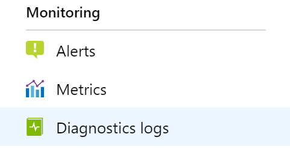

Azure Monitor collects and aggregates metrics and logs from your system to monitor availability, performance, and resilience, and notify you of
issues affecting your system. You can use the Azure portal, PowerShell, Azure CLI, REST API, or client libraries to set up and view monitoring data.

Different metrics and logs are available for different resource types. This article describes the types of monitoring data you can collect for this service
and ways to analyze that data.

Reports provide insight into how your traffic is flowing through Azure Front Door, the web application firewall (WAF), and to your application.

Important

Azure Front Door (classic) will be retired on **March 31, 2027**. To avoid any service disruption, it's important that you **migrate your Azure Front**
**Door (classic) profiles** to Azure Front Door Standard or Premium tier by March 2027. For more information, see **Azure Front Door (classic)**
**retirement**.

### **Collect data with Azure Monitor**

This table describes how you can collect data to monitor your service, and what you can do with the data once collected:

**Data to**
**collect**

**Description**
**How to collect and route the data**
**Where to**
**view the**
**data**

**Supported data**

Metric
data

Metrics are numerical values that describe an
aspect of a system at a particular point in
time. Metrics can be aggregated using
algorithms, compared to other metrics, and
analyzed for trends over time.

- Collected automatically at regular
intervals.
- You can route some platform metrics to a
Log Analytics workspace to query with other
data. Check the **DS export** setting for each
metric to see if you can use a diagnostic
setting to route the metric data.

Metrics
explorer

Azure Front Door
metrics supported
by Azure Monitor

Resource
log data

Logs are recorded system events with a
timestamp. Logs can contain different types
of data, and be structured or free-form text.
You can route resource log data to Log
Analytics workspaces for querying and
analysis.

Create a diagnostic setting to collect and
route resource log data.

Log
Analytics

Azure Front Door
resource log data
supported by Azure
Monitor

Activity
log data

The Azure Monitor activity log provides
insight into subscription-level events. The
activity log includes information like when a
resource is modified or a virtual machine is
started.

- Collected automatically.
- Create a diagnostic setting to a Log
Analytics workspace at no charge.

Activity log

For the list of all of the data supported by Azure Monitor, see:

### **Built-in monitoring for Azure Front Door**

Logs track all requests that pass through Azure Front Door. It can take a few minutes for logs to be processed and stored.

There are multiple Front Door logs, which you can use for different purposes:

Access logs can be used to identify slow requests, determine error rates, and understand how Front Door's caching behavior is working for
your solution.
Web application firewall (WAF) logs can be used to detect potential attacks, and false positive detections that might indicate legitimate
requests that the WAF blocked. For more information on the WAF logs, see Azure Web Application Firewall monitoring and logging.
Health probe logs can be used to identify origins that are unhealthy or that don't respond to requests from some of Front Door's
geographically distributed PoPs.
Activity logs provide visibility into the operations performed on your Azure resources, such as configuration changes to your Azure Front
Door profile.

Access logs and WAF logs include a *tracking reference*, which is also propagated in requests to origins and to client responses by using the X-Azure-
Ref header. You can use the tracking reference to gain an end-to-end view of your application request processing.fi

# **Monitor Azure Front Door**

7/7/25, 8:43 AM
Monitor Azure Front Door

read://https_learn.microsoft.com/?url=https%3A%2F%2Flearn.microsoft.com%2Fen-us%2Fazure%2Ffrontdoor%2Fmonitor-front-door%3Fpivots%3Dfront-door-sta…
1/9

| Data to
collect
Metric
data | Description
Metrics are numerical values that describe an
aspect of a system at a particular point in
time. Metrics can be aggregated using
algorithms, compared to other metrics, and
analyzed for trends over time. | How to collect and route the data
- Collected automatically at regular
intervals.
- You can route some platform metrics to a
Log Analytics workspace to query with other
data. Check the DS export setting for each
metric to see if you can use a diagnostic
setting to route the metric data. | Where to
view the
data
Metrics
explorer | Supported data
Azure Front Door
metrics supported
by Azure Monitor |
| --- | --- | --- | --- | --- |
| Resource
log data | Logs are recorded system events with a
timestamp. Logs can contain different types
of data, and be structured or free-form text.
You can route resource log data to Log
Analytics workspaces for querying and
analysis. | Create a diagnostic setting to collect and
route resource log data. | Log
Analytics | Azure Front Door
resource log data
supported by Azure
Monitor |
| Activity
log data | The Azure Monitor activity log provides
insight into subscription-level events. The
activity log includes information like when a
resource is modified or a virtual machine is
started. | - Collected automatically.
- Create a diagnostic setting to a Log
Analytics workspace at no charge. | Activity log |  |

---
*Page 2*

Access logs, health probe logs, and WAF logs aren't enabled by default. To enable and store your diagnostic logs, see Configure Azure Front Door
logs. Activity log entries are collected by default, and you can view them in the Azure portal.

**Access log**

Information about every request is logged into the access log. Each access log entry contains the information listed in the following table.

**Property**
**Description**

TrackingReference
The unique reference string that identifies a request served by Azure Front Door. The tracking reference is sent to the
client and to the origin by using the X-Azure-Ref headers. Use the tracking reference when searching for a specific
request in the access or WAF logs.

Time
The date and time when the Azure Front Door edge delivered requested contents to client (in UTC). For WebSocket
connections, the time represents when the connection gets closed.

HttpMethod
HTTP method used by the request: DELETE, GET, HEAD, OPTIONS, PATCH, POST, or PUT.

HttpVersion
The HTTP version that the client specified in the request.

RequestUri
The URI of the received request. This field contains the full scheme, port, domain, path, and query string.

HostName
The host name in the request from client. If you enable custom domains and have wildcard domain (*.contoso.com),
the HostName log field's value is subdomain-from-client-request.contoso.com. If you use the Azure Front Door
domain (contoso-123.z01.azurefd.net), the HostName log field's value is contoso-123.z01.azurefd.net.

RequestBytes
The size of the HTTP request message in bytes, including the request headers and the request body. For WebSocket
connections, this value is the total number of bytes sent from the client to the server through the connection.

ResponseBytes
The size of the HTTP response message in bytes. For WebSocket connections, this value is the total number of bytes
sent from the server to the client through the connection.

UserAgent
The user agent that the client used. Typically, the user agent identifies the browser type.

ClientIp
The IP address of the client that made the original request. If there was an X-Forwarded-For header in the request, then
the client IP address is taken from the header.

SocketIp
The IP address of the direct connection to the Azure Front Door edge. If the client used an HTTP proxy or a load
balancer to send the request, the value of SocketIp is the IP address of the proxy or load balancer.

TimeTaken
The duration from when the Azure Front Door edge received the client's request to when the last byte of the response
was sent to the client, measured in seconds. This metric excludes network latency and TCP buffering. For WebSocket
connections, it represents the connection duration from establishment to closure.

RequestProtocol
The protocol specified by the client in the request. Possible values include: **HTTP**, **HTTPS**. For WebSocket, the
protocols are **WS**, **WSS**. Only requests that successfully upgrade to WebSocket have WS/WSS.

SecurityProtocol
The TLS/SSL protocol version used by the request, or null if the request didn't use encryption. Possible values include:
**SSLv3**, **TLSv1**, **TLSv1.1**, **TLSv1.2**.

SecurityCipher
When the value for the request protocol is HTTPS, this field indicates the TLS/SSL cipher negotiated by the client and
Azure Front Door.

Endpoint
The domain name of the Azure Front Door endpoint, such as contoso-123.z01.azurefd.net.

HttpStatusCode
The HTTP status code returned from Azure Front Door. If the request to the origin timed out, the value for the
HttpStatusCode field is **0**. If the client closed the connection, the value for the HttpStatusCode field is **499**.

Pop
The Azure Front Door edge point of presence (PoP) that responded to the user request.

Cache Status
How the Azure Front Door cache handles the request. Possible values are:

**HIT** and **REMOTE_HIT**: The HTTP request was served from the Azure Front Door cache.
**MISS**: The HTTP request was served from origin.
**PARTIAL_HIT**: Some of the bytes were served from the Front Door edge PoP cache, and other bytes were served
from the origin. This status indicates an object chunking scenario.

7/7/25, 8:43 AM
Monitor Azure Front Door

read://https_learn.microsoft.com/?url=https%3A%2F%2Flearn.microsoft.com%2Fen-us%2Fazure%2Ffrontdoor%2Fmonitor-front-door%3Fpivots%3Dfront-door-sta…
2/9

| Property
TrackingReference | Description
The unique reference string that identifies a request served by Azure Front Door. The tracking reference is sent to the
client and to the origin by using the X-Azure-Ref headers. Use the tracking reference when searching for a specific
request in the access or WAF logs. |
| --- | --- |
| Time | The date and time when the Azure Front Door edge delivered requested contents to client (in UTC). For WebSocket
connections, the time represents when the connection gets closed. |
| HttpMethod | HTTP method used by the request: DELETE, GET, HEAD, OPTIONS, PATCH, POST, or PUT. |
| HttpVersion | The HTTP version that the client specifeid in the request. |
| RequestUri | The URI of the received request. This feild contains the full scheme, port, domain, path, and query string. |
| HostName | The host name in the request from client. If you enable custom domains and have wildcard domain (*.contoso.com),
the HostName log field's value is subdomain-from-client-request.contoso.com. If you use the Azure Front Door
domain (contoso-123.z01.azurefd.net), the HostName log feild's value is contoso-123.z01.azurefd.net. |
| RequestBytes | The size of the HTTP request message in bytes, including the request headers and the request body. For WebSocket
connections, this value is the total number of bytes sent from the client to the server through the connection. |
| ResponseBytes | The size of the HTTP response message in bytes. For WebSocket connections, this value is the total number of bytes
sent from the server to the client through the connection. |
| UserAgent | The user agent that the client used. Typically, the user agent identifeis the browser type. |
| ClientIp | The IP address of the client that made the original request. If there was an X-Forwarded-For header in the request, then
the client IP address is taken from the header. |
| SocketIp | The IP address of the direct connection to the Azure Front Door edge. If the client used an HTTP proxy or a load
balancer to send the request, the value of SocketIp is the IP address of the proxy or load balancer. |
| TimeTaken | The duration from when the Azure Front Door edge received the client's request to when the last byte of the response
was sent to the client, measured in seconds. This metric excludes network latency and TCP buffering. For WebSocket
connections, it represents the connection duration from establishment to closure. |
| RequestProtocol | The protocol specified by the client in the request. Possible values include: HTTP, HTTPS. For WebSocket, the
protocols are WS, WSS. Only requests that successfully upgrade to WebSocket have WS/WSS. |
| SecurityProtocol | The TLS/SSL protocol version used by the request, or null if the request didn't use encryption. Possible values include:
SSLv3, TLSv1, TLSv1.1, TLSv1.2. |
| SecurityCipher | When the value for the request protocol is HTTPS, this feild indicates the TLS/SSL cipher negotiated by the client and
Azure Front Door. |
| Endpoint | The domain name of the Azure Front Door endpoint, such as contoso-123.z01.azurefd.net. |
| HttpStatusCode | The HTTP status code returned from Azure Front Door. If the request to the origin timed out, the value for the
HttpStatusCode field is 0. If the client closed the connection, the value for the HttpStatusCode feild is 499. |
| Pop | The Azure Front Door edge point of presence (PoP) that responded to the user request. |
| Cache Status
ttps_learn.microsoft.com/?ur | How the Azure Front Door cache handles the request. Possible values are:
HIT and REMOTE_HIT: The HTTP request was served from the Azure Front Door cache.
MISS: The HTTP request was served from origin.
PARTIAL_HIT: Some of the bytes were served from the Front Door edge PoP cache, and other bytes were served
from the origin. This status indicates an object chunking scenario.
l=https%3A%2F%2Flearn.microsoft.com%2Fen-us%2Fazure%2Ffrontdoor%2Fmonitor-front-door%3Fpivots%3Dfront-door-sta… |

---
*Page 3*

**Property**
**Description**

**CACHE_NOCONFIG**: The request was forwarded without caching settings, including bypass scenarios.
**PRIVATE_NOSTORE**: There was no cache configured in the caching settings by the customer.
**N/A**: A signed URL or WAF rule denied the request.

MatchedRulesSetName
The names of the Rules Engine rules that were processed.

RouteName
The name of the route that the request matched.

ClientPort
The IP port of the client that made the request.

Referrer
The URL of the site that originated the request.

TimetoFirstByte
The length of time, in seconds, from when the Azure Front Door edge received the request to the time the first byte was
sent to client, as measured by Azure Front Door. This property doesn't measure the client data.

ErrorInfo
If an error occurred during the processing of the request, this field provides detailed information about the error.
Possible values are:

**NoError**: Indicates no error was found.
**CertificateError**: Generic SSL certificate error.
**CertificateNameCheckFailed**: The host name in the SSL certificate is invalid or doesn't match the requested URL.
**ClientDisconnected**: The request failed because of a client network connection issue.
**ClientGeoBlocked**: The client was blocked due to the geographical location of the IP address.
**UnspecifiedClientError**: Generic client error.
**InvalidRequest**: Invalid request. This response indicates a malformed header, body, or URL.
**DNSFailure**: A failure occurred during DNS resolution.
**DNSTimeout**: The DNS query to resolve the origin IP address timed out.
**DNSNameNotResolved**: The server name or address couldn't be resolved.
**OriginConnectionAborted**: The connection with the origin was disconnected abnormally.
**OriginConnectionError**: Generic origin connection error.
**OriginConnectionRefused**: The connection with the origin wasn't established.
**OriginError**: Generic origin error.
**ResponseHeaderTooBig**: The origin returned a too large of a response header.
**OriginInvalidResponse**: The origin returned an invalid or unrecognized response.
**OriginTimeout**: The time-out period for the origin request expired.
**ResponseHeaderTooBig**: The origin returned a too large of a response header.
**RestrictedIP**: The request was blocked because of restricted IP address.
**SSLHandshakeError**: Azure Front Door was unable to establish a connection with the origin because of an SSL
handshake failure.
**SSLInvalidRootCA**: The root certification authority's certificate was invalid.
**SSLInvalidCipher**: The HTTPS connection was established using an invalid cipher.
**OriginConnectionAborted**: The connection with the origin was disconnected abnormally.
**OriginConnectionRefused**: The connection with the origin wasn't established.
**UnspecifiedError**: An error occurred that didn’t fit in any of the errors in the table.

OriginURL
The full URL of the origin where the request was sent. The URL is composed of the scheme, host header, port, path,
and query string.
**URL rewrite**: If the Rules Engine rewrites the request URL, the path refers to the rewritten path.
**Cache on edge PoP**: If the request was served from the Azure Front Door cache, the origin is **N/A**.
**Large request**: If the requested content is large and there are multiple chunked requests going back to the origin, this
field corresponds to the first request to the origin. For more information, see Object Chunking.

OriginIP
The IP address of the origin that served the request.
**Cache on edge PoP**: If the request was served from the Azure Front Door cache, the origin is **N/A**.
**Large request**: If the requested content is large and there are multiple chunked requests going back to the origin, this
field corresponds to the first request to the origin. For more information, see Object Chunking.

OriginName
The full hostname (DNS name) of the origin.
**Cache on edge PoP**: If the request was served from the Azure Front Door cache, the origin is **N/A**.
**Large request**: If the requested content is large and there are multiple chunked requests going back to the origin, this
field corresponds to the first request to the origin. For more information, see Object Chunking.

Result
SSLMismatchedSNI is a status code that signifies a successful request with a mismatch warning between the SNI and the
host header. This status code implies domain fronting, a technique that violates Azure Front Door’s terms of service.

7/7/25, 8:43 AM
Monitor Azure Front Door

read://https_learn.microsoft.com/?url=https%3A%2F%2Flearn.microsoft.com%2Fen-us%2Fazure%2Ffrontdoor%2Fmonitor-front-door%3Fpivots%3Dfront-door-sta…
3/9

| MatchedRulesSetName | The names of the Rules Engine rules that were processed. |
| --- | --- |
| RouteName | The name of the route that the request matched. |
| ClientPort | The IP port of the client that made the request. |
| Referrer | The URL of the site that originated the request. |
| TimetoFirstByte | The length of time, in seconds, from when the Azure Front Door edge received the request to the time the first byte was
sent to client, as measured by Azure Front Door. This property doesn't measure the client data. |
| ErrorInfo | If an error occurred during the processing of the request, this field provides detailed information about the error.
Possible values are:
NoError: Indicates no error was found.
CertificateError: Generic SSL certificate error.
CertificateNameCheckFailed: The host name in the SSL certificate is invalid or doesn't match the requested URL.
ClientDisconnected: The request failed because of a client network connection issue.
ClientGeoBlocked: The client was blocked due to the geographical location of the IP address.
UnspecifiedClientError: Generic client error.
InvalidRequest: Invalid request. This response indicates a malformed header, body, or URL.
DNSFailure: A failure occurred during DNS resolution.
DNSTimeout: The DNS query to resolve the origin IP address timed out.
DNSNameNotResolved: The server name or address couldn't be resolved.
OriginConnectionAborted: The connection with the origin was disconnected abnormally.
OriginConnectionError: Generic origin connection error.
OriginConnectionRefused: The connection with the origin wasn't established.
OriginError: Generic origin error.
ResponseHeaderTooBig: The origin returned a too large of a response header.
OriginInvalidResponse: The origin returned an invalid or unrecognized response.
OriginTimeout: The time-out period for the origin request expired.
ResponseHeaderTooBig: The origin returned a too large of a response header.
RestrictedIP: The request was blocked because of restricted IP address.
SSLHandshakeError: Azure Front Door was unable to establish a connection with the origin because of an SSL
handshake failure.
SSLInvalidRootCA: The root certifciation authority's certifciate was invalid.
SSLInvalidCipher: The HTTPS connection was established using an invalid cipher.
OriginConnectionAborted: The connection with the origin was disconnected abnormally.
OriginConnectionRefused: The connection with the origin wasn't established.
UnspecifiedError: An error occurred that didn’t fit in any of the errors in the table. |
| OriginURL | The full URL of the origin where the request was sent. The URL is composed of the scheme, host header, port, path,
and query string.
URL rewrite: If the Rules Engine rewrites the request URL, the path refers to the rewritten path.
Cache on edge PoP: If the request was served from the Azure Front Door cache, the origin is N/A.
Large request: If the requested content is large and there are multiple chunked requests going back to the origin, this
field corresponds to the first request to the origin. For more information, see Object Chunking. |
| OriginIP | The IP address of the origin that served the request.
Cache on edge PoP: If the request was served from the Azure Front Door cache, the origin is N/A.
Large request: If the requested content is large and there are multiple chunked requests going back to the origin, this
field corresponds to the first request to the origin. For more information, see Object Chunking. |
| OriginName | The full hostname (DNS name) of the origin.
Cache on edge PoP: If the request was served from the Azure Front Door cache, the origin is N/A.
Large request: If the requested content is large and there are multiple chunked requests going back to the origin, this
field corresponds to the first request to the origin. For more information, see Object Chunking. |
| Result
ttps_learn.microsoft.com/?ur | SSLMismatchedSNI is a status code that signifeis a successful request with a mismatch warning between the SNI and the
host header. This status code implies domain fronting, a technique that violates Azure Front Door’s terms of service.
l=https%3A%2F%2Flearn.microsoft.com%2Fen-us%2Fazure%2Ffrontdoor%2Fmonitor-front-door%3Fpivots%3Dfront-door-sta… |

---
*Page 4*

**Property**
**Description**

Requests with SSLMismatchedSNI will be rejected after January 22, 2024.

Sni
This field specifies the Server Name Indication (SNI) that is sent during the TLS/SSL handshake. It can be used to
identify the exact SNI value if there was a SSLMismatchedSNI status code. Additionally, it can be compared with the
host value in the requestUri field to detect and resolve the mismatch issue.

**Health probe log**

Azure Front Door logs every failed health probe request. These logs can help you to diagnose problems with an origin. The logs provide you with
information that you can use to investigate the failure reason and then bring the origin back to a healthy status.

Some scenarios this log can be useful for are:

You noticed Azure Front Door traffic was sent to a subset of the origins. For example, you might notice that only three out of four origins
receive traffic. You want to know if the origins are receiving and responding to health probes so you know whether the origins are healthy.
You noticed the origin health percentage metric is lower than you expected. You want to know which origins are recorded as unhealthy and
the reason for the health probe failures.

Each health probe log entry has the following schema:

**Property**
**Description**

HealthProbeId
A unique ID to identify the health probe request.

Time
The date and time when the health probe was sent (in UTC).

HttpMethod
The HTTP method used by the health probe request. Values include **GET** and **HEAD**, based on the health probe's
configuration.

Result
The status of health probe. The value is either **success** or a description of the error the probe received.

HttpStatusCode
The HTTP status code returned by the origin.

ProbeURL
The full target URL to where the probe request was sent. The URL is composed of the scheme, host header, path, and
query string.

OriginName
The name of the origin that the health probe was sent to. This field helps you to locate origins of interest if origin is
configured to use an FQDN.

POP
The edge PoP that sent the probe request.

Origin IP
The IP address of the origin that the health probe was sent to.

TotalLatency
The time from when the Azure Front Door edge sent the health probe request to the origin to when the origin sent the last
response to Azure Front Door.

ConnectionLatency
The time spent setting up the TCP connection to send the HTTP probe request to the origin.

DNSResolution
Latency

The time spent on DNS resolution. This field only has a value if the origin is configured to be an FQDN instead of an IP
address. If the origin is configured to use an IP address, the value is **N/A**.

The following example JSON snippet shows a health probe log entry for a failed health probe request.
JSON
{
  "records": [
    {
      "time": "2021-02-02T07:15:37.3640748Z",
      "resourceId": "/SUBSCRIPTIONS/mySubscriptionID/RESOURCEGROUPS/myResourceGroup/PROVIDERS/MICROSOFT.CDN/PROFILES/MyProfile",
      "category": "FrontDoorHealthProbeLog",
      "operationName": "Microsoft.Cdn/Profiles/FrontDoorHealthProbeLog/Write",
      "properties": {
        "healthProbeId": "9642AEA07BA64675A0A7AD214ACF746E",
        "POP": "MAA",
        "httpVerb": "HEAD",
        "result": "OriginError",
        "httpStatusCode": "400",
        "probeURL": "http://www.example.com:80/",

7/7/25, 8:43 AM
Monitor Azure Front Door

read://https_learn.microsoft.com/?url=https%3A%2F%2Flearn.microsoft.com%2Fen-us%2Fazure%2Ffrontdoor%2Fmonitor-front-door%3Fpivots%3Dfront-door-sta…
4/9

| Property | Description
Requests with SSLMismatchedSNI will be rejected after January 22, 2024. |
| --- | --- |
| Sni | This field specifies the Server Name Indication (SNI) that is sent during the TLS/SSL handshake. It can be used to
identify the exact SNI value if there was a SSLMismatchedSNI status code. Additionally, it can be compared with the
host value in the requestUri field to detect and resolve the mismatch issue. |

| Property
HealthProbeId | Description
A unique ID to identify the health probe request. |
| --- | --- |
| Time | The date and time when the health probe was sent (in UTC). |
| HttpMethod | The HTTP method used by the health probe request. Values include GET and HEAD, based on the health probe's
configuration. |
| Result | The status of health probe. The value is either success or a description of the error the probe received. |
| HttpStatusCode | The HTTP status code returned by the origin. |
| ProbeURL | The full target URL to where the probe request was sent. The URL is composed of the scheme, host header, path, and
query string. |
| OriginName | The name of the origin that the health probe was sent to. This feild helps you to locate origins of interest if origin is
configured to use an FQDN. |
| POP | The edge PoP that sent the probe request. |
| Origin IP | The IP address of the origin that the health probe was sent to. |
| TotalLatency | The time from when the Azure Front Door edge sent the health probe request to the origin to when the origin sent the last
response to Azure Front Door. |
| ConnectionLatency | The time spent setting up the TCP connection to send the HTTP probe request to the origin. |
| DNSResolution
Latency | The time spent on DNS resolution. This field only has a value if the origin is configured to be an FQDN instead of an IP
address. If the origin is configured to use an IP address, the value is N/A. |

---
*Page 5*

        "originName": "www.example.com",
        "originIP": "PublicI:Port",
        "totalLatencyMilliseconds": "141",
        "connectionLatencyMilliseconds": "68",
        "DNSLatencyMicroseconds": "1814"
      }
    }
  ]
}

**Web application firewall log**

For more information on the Front Door web application firewall (WAF) logs, see Azure Web Application Firewall monitoring and logging.

For classic Azure Front Door, built-in monitoring includes diagnostic logs.

**Diagnostic logs**

Diagnostic logs provide rich information about operations and errors that are important for auditing and troubleshooting. Diagnostic logs differ from
activity logs.

Activity logs provide insights into the operations done on Azure resources. Diagnostic logs provide insight into operations that your resource does.
For more information, see Azure Monitor diagnostic logs.

To configure diagnostic logs for your Azure Front Door (classic):

1. Select your Azure Front Door (classic) profile.

2. Choose **Diagnostic settings**.

3. Select **Turn on diagnostics**. Archive diagnostic logs along with metrics to a storage account, stream them to an event hub, or send them to

Azure Monitor logs.

Front Door currently provides diagnostic logs. Diagnostic logs provide individual API requests with each entry having the following schema:

**Property**
**Description**

BackendHostname
If request was being forwarded to a backend, this field represents the hostname of the backend. This field
is blank if the request gets redirected or forwarded to a regional cache (when caching gets enabled for the
routing rule).

CacheStatus
For caching scenarios, this field defines the cache hit/miss at the POP

ClientIp
The IP address of the client that made the request. If there was an X-Forwarded-For header in the request,
then the Client IP is picked from the same.

ClientPort
The IP port of the client that made the request.

HttpMethod
HTTP method used by the request.

HttpStatusCode
The HTTP status code returned from the proxy. If a request to the origin times out, the value for
HttpStatusCode is set to **0**.

HttpStatusDetails
Resulting status on the request. Meaning of this string value can be found at a Status reference table.

HttpVersion
Type of the request or connection.

7/7/25, 8:43 AM
Monitor Azure Front Door

read://https_learn.microsoft.com/?url=https%3A%2F%2Flearn.microsoft.com%2Fen-us%2Fazure%2Ffrontdoor%2Fmonitor-front-door%3Fpivots%3Dfront-door-sta…
5/9

| Property
BackendHostname | Description
If request was being forwarded to a backend, this feild represents the hostname of the backend. This field
is blank if the request gets redirected or forwarded to a regional cache (when caching gets enabled for the
routing rule). |
| --- | --- |
| CacheStatus | For caching scenarios, this feild defnies the cache hit/miss at the POP |
| ClientIp | The IP address of the client that made the request. If there was an X-Forwarded-For header in the request,
then the Client IP is picked from the same. |
| ClientPort | The IP port of the client that made the request. |
| HttpMethod | HTTP method used by the request. |
| HttpStatusCode | The HTTP status code returned from the proxy. If a request to the origin times out, the value for
HttpStatusCode is set to 0. |
| HttpStatusDetails | Resulting status on the request. Meaning of this string value can be found at a Status reference table. |
| HttpVersion | Type of the request or connection. |

---
*Page 6*

**Property**
**Description**

POP
Short name of the edge where the request landed.

RequestBytes
The size of the HTTP request message in bytes, including the request headers and the request body.

RequestUri
URI of the received request.

ResponseBytes
Bytes sent by the backend server as the response.

RoutingRuleName
The name of the routing rule that the request matched.

RulesEngineMatchNames
The names of the rules that the request matched.

SecurityProtocol
The TLS/SSL protocol version used by the request or null if no encryption.

SentToOriginShield
(deprecated) * **See notes on**
**deprecation in the following**
**section.**

If true, it means that request was answered from origin shield cache instead of the edge pop. Origin shield
is a parent cache used to improve cache hit ratio.

isReceivedFromClient
If true, it means that the request came from the client. If false, the request is a miss in the edge (child POP)
and is responded from origin shield (parent POP).

TimeTaken
The length of time from first byte of request into Front Door to last byte of response out, in seconds.

TrackingReference
The unique reference string that identifies a request served by Front Door, also sent as X-Azure-Ref
header to the client. Required for searching details in the access logs for a specific request.

UserAgent
The browser type that the client used.

ErrorInfo
This field contains the specific type of error for further troubleshooting.
Possible values include:
**NoError**: Indicates no error was found.
**CertificateError**: Generic SSL certificate error.
**CertificateNameCheckFailed**: The host name in the SSL certificate is invalid or doesn't match.
**ClientDisconnected**: Request failure because of client network connection.
**UnspecifiedClientError**: Generic client error.
**InvalidRequest**: Invalid request. It might occur because of malformed header, body, and URL.
**DNSFailure**: DNS Failure.
**DNSNameNotResolved**: The server name or address couldn't be resolved.
**OriginConnectionAborted**: The connection with the origin was stopped abruptly.
**OriginConnectionError**: Generic origin connection error.
**OriginConnectionRefused**: The connection with the origin wasn't able to established.
**OriginError**: Generic origin error.
**OriginInvalidResponse**: Origin returned an invalid or unrecognized response.
**OriginTimeout**: The time-out period for origin request expired.
**ResponseHeaderTooBig**: The origin returned too large of a response header.
**RestrictedIP**: The request was blocked because of restricted IP.
**SSLHandshakeError**: Unable to establish connection with origin because of SSL hand shake failure.
**UnspecifiedError**: An error occurred that didn’t fit in any of the errors in the table.
**SSLMismatchedSNI**: The request was invalid because the HTTP message header didn't match the value
presented in the TLS SNI extension during SSL/TLS connection setup.

Result
SSLMismatchedSNI is a status code that signifies a successful request with a mismatch warning between
the SNI and the host header. This status code implies domain fronting, a technique that violates Azure
Front Door’s terms of service. Requests with SSLMismatchedSNI will be rejected after January 22, 2024.

Sni
This field specifies the Server Name Indication (SNI) that is sent during the TLS/SSL handshake. It can be
used to identify the exact SNI value if there was a SSLMismatchedSNI status code. Additionally, it can be
compared with the host value in the requestUri field to detect and resolve the mismatch issue.

**Sent to origin shield deprecationfifi**

7/7/25, 8:43 AM
Monitor Azure Front Door

read://https_learn.microsoft.com/?url=https%3A%2F%2Flearn.microsoft.com%2Fen-us%2Fazure%2Ffrontdoor%2Fmonitor-front-door%3Fpivots%3Dfront-door-sta…
6/9

| Property | Description |
| --- | --- |
| POP | Short name of the edge where the request landed. |
| RequestBytes | The size of the HTTP request message in bytes, including the request headers and the request body. |
| RequestUri | URI of the received request. |
| ResponseBytes | Bytes sent by the backend server as the response. |
| RoutingRuleName | The name of the routing rule that the request matched. |
| RulesEngineMatchNames | The names of the rules that the request matched. |
| SecurityProtocol | The TLS/SSL protocol version used by the request or null if no encryption. |
| SentToOriginShield
(deprecated) * See notes on
deprecation in the following
section. | If true, it means that request was answered from origin shield cache instead of the edge pop. Origin shield
is a parent cache used to improve cache hit ratio. |
| isReceivedFromClient | If true, it means that the request came from the client. If false, the request is a miss in the edge (child POP)
and is responded from origin shield (parent POP). |
| TimeTaken | The length of time from frist byte of request into Front Door to last byte of response out, in seconds. |
| TrackingReference | The unique reference string that identifeis a request served by Front Door, also sent as X-Azure-Ref
header to the client. Required for searching details in the access logs for a specifci request. |
| UserAgent | The browser type that the client used. |
| ErrorInfo | This field contains the specific type of error for further troubleshooting.
Possible values include:
NoError: Indicates no error was found.
CertificateError: Generic SSL certifciate error.
CertificateNameCheckFailed: The host name in the SSL certifciate is invalid or doesn't match.
ClientDisconnected: Request failure because of client network connection.
UnspecifiedClientError: Generic client error.
InvalidRequest: Invalid request. It might occur because of malformed header, body, and URL.
DNSFailure: DNS Failure.
DNSNameNotResolved: The server name or address couldn't be resolved.
OriginConnectionAborted: The connection with the origin was stopped abruptly.
OriginConnectionError: Generic origin connection error.
OriginConnectionRefused: The connection with the origin wasn't able to established.
OriginError: Generic origin error.
OriginInvalidResponse: Origin returned an invalid or unrecognized response.
OriginTimeout: The time-out period for origin request expired.
ResponseHeaderTooBig: The origin returned too large of a response header.
RestrictedIP: The request was blocked because of restricted IP.
SSLHandshakeError: Unable to establish connection with origin because of SSL hand shake failure.
UnspecifiedError: An error occurred that didn’t fti in any of the errors in the table.
SSLMismatchedSNI: The request was invalid because the HTTP message header didn't match the value
presented in the TLS SNI extension during SSL/TLS connection setup. |
| Result | SSLMismatchedSNI is a status code that signifies a successful request with a mismatch warning between
the SNI and the host header. This status code implies domain fronting, a technique that violates Azure
Front Door’s terms of service. Requests with SSLMismatchedSNI will be rejected after January 22, 2024. |
| Sni | This field specifies the Server Name Indication (SNI) that is sent during the TLS/SSL handshake. It can be
used to identify the exact SNI value if there was a SSLMismatchedSNI status code. Additionally, it can be
compared with the host value in the requestUri field to detect and resolve the mismatch issue. |

---
*Page 7*

The raw log property **isSentToOriginShield** is deprecated and replaced by a new field **isReceivedFromClient**. Use the new field if you're already
using the deprecated field.

Raw logs include logs generated from both CDN edge (child POP) and origin shield. Origin shield refers to parent nodes that are strategically located
across the globe. These nodes communicate with origin servers and reduce the traffic load on origin.

For every request that goes to an origin shield, there are two log entries:

One for edge nodes
One for origin shield

To differentiate the egress or responses from the edge nodes vs. origin shield, you can use the field **isReceivedFromClient** to get the correct data.

If the value is false, then it means the request is responded from origin shield to edge nodes. This approach is effective to compare raw logs with
billing data. Charges aren't incurred for egress from origin shield to the edge nodes. Charges are incurred for egress from the edge nodes to clients.

**Kusto query sample to exclude logs generated on origin shield in Log Analytics.**

AzureDiagnostics | where Category == "FrontdoorAccessLog" and isReceivedFromClient_b == true

Note

For various routing configurations and traffic behaviors, some of the fields like backendHostname, cacheStatus, isReceivedFromClient, and POP field
might respond with different values. The following table explains the different values these fields have for various scenarios:

**Scenarios**
**Count of**
**log**
**entries**

**POP**
**BackendHostname**
**isReceivedFromClient**
**CacheStatus**

Routing rule without caching enabled
1
Edge POP
code

Backend where request
was forwarded

True
CONFIG_NOCACHE

Routing rule with caching enabled.
Cache hit at the edge POP

1
Edge POP
code

Empty
True
HIT

Routing rule with caching enabled.
Cache misses at edge POP but cache
hit at parent cache POP

2
1. Edge
POP code
2. Parent
cache POP
code

1. Parent cache POP
hostname
2. Empty

1. True
2. False

1. MISS
2. HIT

Routing rule with caching enabled.
Caches miss at edge POP but
PARTIAL cache hit at parent cache
POP

2
1. Edge
POP code
2. Parent
cache POP
code

1. Parent cache POP
hostname
2. Backend that helps
populate cache

1. True
2. False

1. MISS
2. PARTIAL_HIT

Routing rule with caching enabled.
Cache PARTIAL_HIT at edge POP
but cache hit at parent cache POP

2
1. Edge
POP code
2. Parent
cache POP
code

1. Edge POP code
2. Parent cache POP
code

1. True
2. False

1. PARTIAL_HIT
2. HIT

Routing rule with caching enabled.
Cache misses at both edge and parent
cache POP

2
1. Edge
POP code
2. Parent
cache POP
code

1. Edge POP code
2. Parent cache POP
code

1. True
2. False

1. MISS
2. MISS

Error processing the request
N/A

Note

For caching scenarios, the value for Cache Status is a PARTIAL_HIT when some of the bytes for a request get served from the Azure Front Door
edge or origin shield cache while some of the bytes get served from the origin for large objects.

Azure Front Door uses a technique called object chunking. When a large file is requested, the Azure Front Door retrieves smaller pieces of the file
from the origin. After the Azure Front Door POP server receives a full or byte-ranges of the file requested, the Azure Front Door edge server requests
the file from the origin in chunks of 8 MB.

7/7/25, 8:43 AM
Monitor Azure Front Door

read://https_learn.microsoft.com/?url=https%3A%2F%2Flearn.microsoft.com%2Fen-us%2Fazure%2Ffrontdoor%2Fmonitor-front-door%3Fpivots%3Dfront-door-sta…
7/9

| Scenarios
Routing rule without caching enabled | Count of
log
entries
1 | POP
Edge POP
code | BackendHostname
Backend where request
was forwarded | isReceivedFromClient
True | CacheStatus
CONFIG_NOCACHE |
| --- | --- | --- | --- | --- | --- |
| Routing rule with caching enabled.
Cache hit at the edge POP | 1 | Edge POP
code | Empty | True | HIT |
| Routing rule with caching enabled.
Cache misses at edge POP but cache
hit at parent cache POP | 2 | 1. Edge
POP code
2. Parent
cache POP
code | 1. Parent cache POP
hostname
2. Empty | 1. True
2. False | 1. MISS
2. HIT |
| Routing rule with caching enabled.
Caches miss at edge POP but
PARTIAL cache hit at parent cache
POP | 2 | 1. Edge
POP code
2. Parent
cache POP
code | 1. Parent cache POP
hostname
2. Backend that helps
populate cache | 1. True
2. False | 1. MISS
2. PARTIAL_HIT |
| Routing rule with caching enabled.
Cache PARTIAL_HIT at edge POP
but cache hit at parent cache POP | 2 | 1. Edge
POP code
2. Parent
cache POP
code | 1. Edge POP code
2. Parent cache POP
code | 1. True
2. False | 1. PARTIAL_HIT
2. HIT |
| Routing rule with caching enabled.
Cache misses at both edge and parent
cache POP | 2 | 1. Edge
POP code
2. Parent
cache POP
code | 1. Edge POP code
2. Parent cache POP
code | 1. True
2. False | 1. MISS
2. MISS |
| Error processing the request | N/A |  |  |  |  |

---
*Page 8*

After the chunk arrives at the Azure Front Door edge, it's cached and immediately served to the user. The Azure Front Door then prefetches the next
chunk in parallel. This prefetch ensures the content stays one chunk ahead of the user, which reduces latency. This process continues until the entire
file gets downloaded (if requested), all byte ranges are available (if requested), or the client closes the connection. For more information on the byte-
range request, see RFC 7233. The Azure Front Door caches any chunks as they're received. The entire file doesn't need to be cached on the Front
Door cache. Ensuing requests for the file or byte ranges are served from the Azure Front Door cache. If not all the chunks are cached on the Azure
Front Door, prefetch is used to request chunks from the origin. This optimization relies on the ability of the origin server to support byte-range
requests. If the origin server doesn't support byte-range requests, this optimization isn't effective.

### **Use Azure Monitor tools to analyze the data**

These Azure Monitor tools are available in the Azure portal to help you analyze monitoring data:

Some Azure services have a built-in monitoring dashboard in the Azure portal. These dashboards are called *insights*, and you can find
them in the **Insights** section of Azure Monitor in the Azure portal.

Metrics explorer allows you to view and analyze metrics for Azure resources. For more information, see Analyze metrics with Azure
Monitor metrics explorer.

Log Analytics allows you to query and analyze log data using the Kusto query language (KQL). For more information, see Get started
with log queries in Azure Monitor.

The Azure portal has a user interface for viewing and basic searches of the activity log. To do more in-depth analysis, route the data to
Azure Monitor logs and run more complex queries in Log Analytics.

Application Insights monitors the availability, performance, and usage of your web applications, so you can identify and diagnose errors
without waiting for a user to report them.
Application Insights includes connection points to various development tools and integrates with Visual Studio to support your DevOps
processes. For more information, see Application monitoring for App Service.

Tools that allow more complex visualization include:

Dashboards that let you combine different kinds of data into a single pane in the Azure portal.
Workbooks, customizable reports that you can create in the Azure portal. Workbooks can include text, metrics, and log queries.
Grafana, an open platform tool that excels in operational dashboards. You can use Grafana to create dashboards that include data from
multiple sources other than Azure Monitor.
Power BI, a business analytics service that provides interactive visualizations across various data sources. You can configure Power BI to
automatically import log data from Azure Monitor to take advantage of these visualizations.

### **Export Azure Monitor data**

You can export data out of Azure Monitor into other tools using:

To get started with the Azure Monitor REST API, see Azure monitoring REST API walkthrough.

### **Use Kusto queries to analyze log data**

You can analyze Azure Monitor Log data using the Kusto query language (KQL). For more information, see Log queries in Azure Monitor.

### **Use Azure Monitor alerts to notify you of issues**

Azure Monitor alerts allow you to identify and address issues in your system, and proactively notify you when specific conditions are found in your
monitoring data before your customers notice them. You can alert on any metric or log data source in the Azure Monitor data platform. There are
different types of Azure Monitor alerts depending on the services you're monitoring and the monitoring data you're collecting. See Choosing the right
type of alert rule.

For examples of common alerts for Azure resources, see Sample log alert queries.

**Implementing alerts at scale**

For some services, you can monitor at scale by applying the same metric alert rule to multiple resources of the same type that exist in the same Azure
region. Azure Monitor Baseline Alerts (AMBA) provides a semi-automated method of implementing important platform metric alerts, dashboards,
and guidelines at scale.

### **Get personalized recommendations using Azure Advisor**

For some services, if critical conditions or imminent changes occur during resource operations, an alert displays on the service **Overview** page in the
portal. You can find more information and recommended fixes for the alert in **Advisor recommendations** under **Monitoring** in the left menu. During
normal operations, no advisor recommendations display.

7/7/25, 8:43 AM
Monitor Azure Front Door

read://https_learn.microsoft.com/?url=https%3A%2F%2Flearn.microsoft.com%2Fen-us%2Fazure%2Ffrontdoor%2Fmonitor-front-door%3Fpivots%3Dfront-door-sta…
8/9

---
*Page 9*

For more information on Azure Advisor, see Azure Advisor overview.

### **Related content**

7/7/25, 8:43 AM
Monitor Azure Front Door

read://https_learn.microsoft.com/?url=https%3A%2F%2Flearn.microsoft.com%2Fen-us%2Fazure%2Ffrontdoor%2Fmonitor-front-door%3Fpivots%3Dfront-door-sta…
9/9