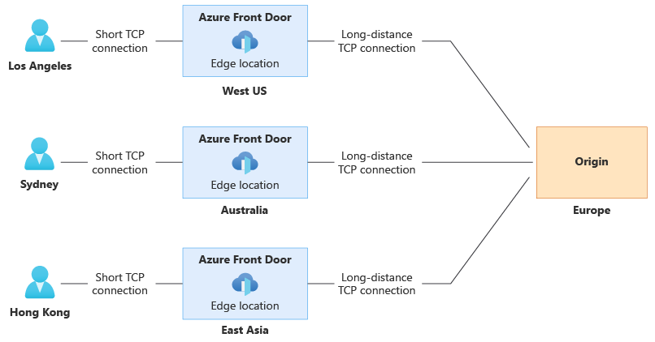

**Applies to:** ✔️ Front Door Standard ✔️ Front Door Premium ✔️ Front Door (classic)

Important

Azure Front Door (classic) will be retired on **March 31, 2027**. To avoid any service disruption, it's
important that you **migrate your Azure Front Door (classic) profiles** to Azure Front Door Standard or
Premium tier by March 2027. For more information, see **Azure Front Door (classic) retirement**.

Azure Front Door supports four traffic routing methods to manage how your HTTP/HTTPS traffic is
distributed among different origins. When user requests reach the Front Door edge locations, the
configured routing method ensures requests are forwarded to the best backend resource.

Note

In this article, an *Origin* refers to the backend, and an *origin group* refers to the backend pool in the
Azure Front Door (classic) configuration.

The four traffic routing methods are:

**Latency****:** Routes requests to the origins with the lowest latency within an acceptable
sensitivity range, ensuring requests are sent to the nearest origins in terms of network
latency.

**Priority****:** Allows you to set a priority for your origins, designating a primary origin to
handle all traffic and a secondary origin as a backup if the primary becomes unavailable.

**Weighted****:** Assigns a weight to each origin to distribute traffic evenly or according to
specified weight coefficients. Traffic is distributed based on weight values if the origins'
latencies are within the acceptable sensitivity range.

**Session Affinity****:** Ensures requests from the same end user are sent to the same origin by
configuring session affinity for your frontend hosts or domains.

Note

In Azure Front Door Standard and Premium tiers, **Endpoint name** is referred to as **Frontend host** in
Azure Front Door (classic).

All Front Door configurations include backend health monitoring and automated global failover. For
more information, see Front Door backend monitoring. Azure Front Door can use a single routing
method or combine multiple methods to create an optimal routing topology based on your application
needs.

Note

Using the Front Door rules engine, you can configure rules to override route configurations in Azure
Front Door Standard and Premium tiers or override the backend pool in Azure Front Door (classic) for
a request. The origin group or backend pool set by the rules engine will override the routing process
described in this article.

# **Traffic routing methods to origin**

7/7/25, 9:08 AM
Traffic routing methods to origin

read://https_learn.microsoft.com/?url=https%3A%2F%2Flearn.microsoft.com%2Fen-us%2Fazure%2Ffrontdoor%2Frouting-methods%3Fsource%3Drecommendations
1/5

---
*Page 2*

# **Overall decision flow**

The following diagram illustrates the overall decision flow:

The decision steps are:

1. **Available origins:** Select all origins that are enabled and healthy (200 OK) based on the

health probe.

*Example: If there are six origins A, B, C, D, E, and F, and C is unhealthy and E*
*is disabled, the available origins are A, B, D, and F.*

2. **Priority:** Select the top priority origins from the available ones.

*Example: If origins A, B, and D have priority 1 and origin F has priority 2, the*
*selected origins are A, B, and D.*

3. **Latency signal (based on health probe):** Select origins within the allowable latency range

from the Front Door environment where the request arrived. This is based on the latency
sensitivity setting of the origin group and the latency of the closest origins.

*Example: If the latency to origin A is 15 ms, to B is 30 ms, and to D is 60 ms,*
*and the latency sensitivity is set to 30 ms, the selected origins are A and B, as D*
*exceeds the 30-ms range.*

4. **Weights:** Distribute traffic among the final selected origins based on the specified weight

ratios.

*Example: If origin A has a weight of 3 and origin B has a weight of 7, traffic is*
*distributed 3/10 to A and 7/10 to B.*

If session affinity is enabled, the first request in a session follows the flow previous explained.
Subsequent requests are sent to the origin selected in the first request.

7/7/25, 9:08 AM
Traffic routing methods to origin

read://https_learn.microsoft.com/?url=https%3A%2F%2Flearn.microsoft.com%2Fen-us%2Fazure%2Ffrontdoor%2Frouting-methods%3Fsource%3Drecommendations
2/5

---
*Page 3*

Deploying origins in multiple global locations can enhance your application's responsiveness by
routing traffic to the origin that is 'closest' to your end users. The Latency routing method is the default
for Azure Front Door configurations. This method directs user requests to the origin with the lowest
network latency, rather than the closest geographic location, ensuring optimal performance.

Azure Front Door's anycast architecture, combined with the Latency routing method, ensures that each
user experiences the best performance based on their location. Each Front Door environment
independently measures the latency to origins, meaning users in different locations are routed to the
origin that offers the best performance for their specific environment.

Note

By default, the latency sensitivity property is set to 0 ms. With this setting, requests are always
forwarded to the fastest available origins. Weights on the origins only take effect if two origins have the
same network latency.

For more information, see Azure Front Door routing architecture.

# **Priority-based traffic-routing**

To ensure high availability, organizations often deploy backup services to take over if the primary
service fails. This setup is known as Active/Standby or Active/Passive deployment. The *Priority* traffic-
routing method in Azure Front Door allows you to implement this failover pattern effectively.

By default, Azure Front Door routes traffic to the origins with the highest priority (lowest priority
value). If these primary origins become unavailable, it routes traffic to the secondary origins (next
lowest priority value). This process continues with tertiary origins if both primary and secondary
origins are unavailable. Health probes monitor the availability of origins based on their configured
status and health.

## **Configuring priority for origins**

Each origin in your Azure Front Door origin group has a *Priority* property, which can be set to a value
between 1 and 5. Lower values indicate higher priority. Multiple origins can share the same priority
value.

# **Weighted traffic-routing method**

Note

For customers with very low RPS (Requests Per Second), due to the nature of how distributed AFD
POPs and machines are, we cannot guarantee that the weights configured by the customer will be
strictly followed and the load balancing may appear skewed.

The *Weighted* traffic-routing method allows you to distribute traffic based on predefined weights.

In this method, you assign a weight to each origin in your Azure Front Door origin group. The weight
is an integer between 1 and 1000, with a default value of **50**.

7/7/25, 9:08 AM
Traffic routing methods to origin

read://https_learn.microsoft.com/?url=https%3A%2F%2Flearn.microsoft.com%2Fen-us%2Fazure%2Ffrontdoor%2Frouting-methods%3Fsource%3Drecommendations
3/5

---
*Page 4*

Traffic is distributed among available origins using a round-robin mechanism based on the specified
weight ratios, provided the origins meet the acceptable latency sensitivity. If the latency sensitivity is
set to 0 milliseconds, weights only take effect if two origins have the same network latency.

The weighted method supports several scenarios:

**Gradual application upgrade**: Route a percentage of traffic to a new origin and gradually
increase it over time.
**Application migration to Azure**: Create an origin group with both Azure and external
origins. Adjust weights to prefer new origins, gradually increasing their traffic share until
they handle most traffic, then disable and remove less preferred origins.
**Cloud-bursting for additional capacity**: Expand on-premises deployments into the cloud
by adding or enabling more origins and specifying traffic distribution.

# **Session affinity**

By default, Azure Front Door forwards requests from the same client to different origins. However,
session affinity is useful for stateful applications or scenarios where subsequent requests from the same
user need to be processed by the same origin. This feature ensures that the same origin handles a user's
session, which is beneficial for scenarios like client authentication.

Azure Front Door uses cookie-based session affinity, where managed cookies with SHA256 of the
origin URL as the identifier are used. This directs subsequent traffic from a user session to the same
origin.

Session affinity can be enabled at the origin group level in Azure Front Door Standard and Premium
tiers, and at the frontend host level in Azure Front Door (classic) for each configured domain or
subdomain. Once enabled, Azure Front Door adds cookies named ASLBSA and ASLBSACORS to the user's
session. These cookies help identify different users even if they share the same IP address, allowing for
a more even distribution of traffic among origins.

The cookie's lifetime matches the user's session, as Front Door currently supports only session cookies.

Note

Session affinity is maintained through the browser session cookie at the domain level. Subdomains
under the same wildcard domain can share session affinity as long as the user's browser sends requests
for the same origin resource.

Public proxies may interfere with session affinity because establishing a session requires Front Door to
add a session affinity cookie to the response. This cannot be done if the response is cacheable, as it
would disrupt cookies for other clients requesting the same resource. To prevent this, session affinity
will **not** be established if the origin sends a cacheable response. If the session is already established, the
cacheability of the response does not matter.

Session affinity will be established in the following circumstances beyond the standard non-cacheable
scenarios:

The response includes the Cache-Control header with *no-store*.
The response contains a valid Authorization header.
The response is an HTTP 302 status code.

7/7/25, 9:08 AM
Traffic routing methods to origin

read://https_learn.microsoft.com/?url=https%3A%2F%2Flearn.microsoft.com%2Fen-us%2Fazure%2Ffrontdoor%2Frouting-methods%3Fsource%3Drecommendations
4/5

---
*Page 5*

# **Next steps**

7/7/25, 9:08 AM
Traffic routing methods to origin

read://https_learn.microsoft.com/?url=https%3A%2F%2Flearn.microsoft.com%2Fen-us%2Fazure%2Ffrontdoor%2Frouting-methods%3Fsource%3Drecommendations
5/5